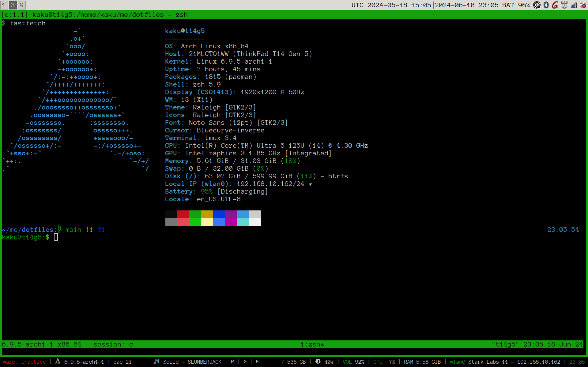

# Dotfiles

My Linux (Arch + i3) dotfiles, managed with [dotter](https://github.com/SuperCuber/dotter).

## Screenshots



## What's inside

| Area | Configs |
| --- | --- |
| Desktop (`i3` package) | i3, polybar, i3blocks, dunst, rofi, picom |
| Terminal (`term` package) | alacritty, tmux, zsh, neovim, powerlevel10k |
| Everywhere (`default` package) | git, lazygit, commitizen, claude, fonts, scripts, wallpapers |
| Submodules | private configs (personal, work) |

Configs are grouped into dotter packages (`default`, `i3`, `term`) defined in
`.dotter/global.toml`. Machine-specific settings — which packages to deploy,
fonts, font sizes, displays, DPI, wallpaper — live in `.dotter/local.toml`,
which is gitignored so each machine keeps its own copy.

## Requirements

- [dotter](https://github.com/SuperCuber/dotter)
- make
- Access to the private submodules (optional — skip them on machines that don't need them)

## Getting started

```shell
git clone --recurse-submodules git@github.com:joshuatonga/dotfiles.git
cd dotfiles
```

Create `.dotter/local.toml` and pick the packages for this machine:

```toml
includes = []
packages = ["default", "term"]  # add "i3" on desktop machines

[files]

[variables]
# per-machine overrides, e.g.:
# term_font_size = 14
# dpi = 96
```

Then deploy:

```shell
make install
```

## Uninstall

```shell
make uninstall
```
